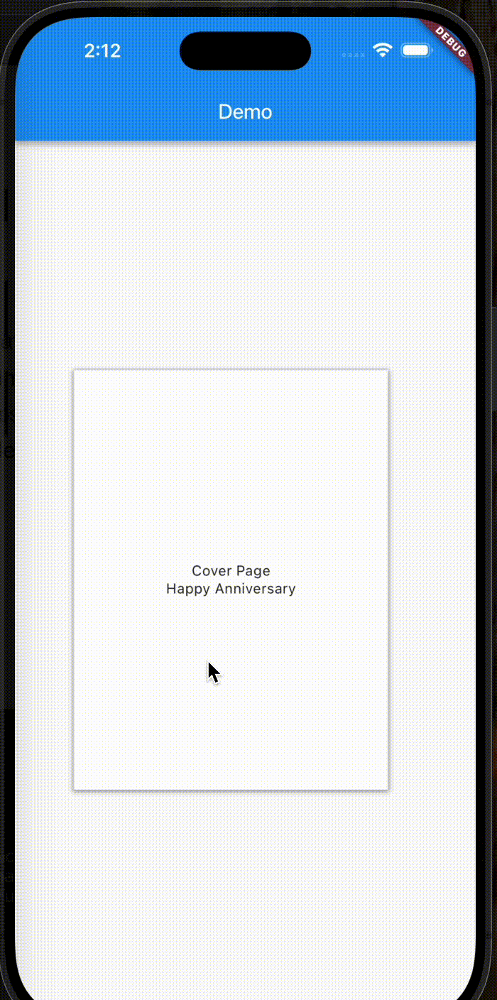

# BookFlip Flutter Package

The `BookFlip` is a custom Flutter widget that simulates a book flipping effect. It allows you to display content in the form of a book with a cover page and flip through pages with an animated 3D effect. This widget is customizable, supporting various settings such as flip duration, page spacing, shadow effects, and more.

## Demo

Here’s a demonstration of the `BookFlip` in action:

{width=180 height=360}

> _Above: A book-flipping animation showcasing the `BookFlip`._

---

## Features

- **Book Flip Animation**: Provides a 3D flipping effect for pages.
- **Customizable Cover Page**: Optionally display a cover page before the content starts.
- **Page Looping**: Enable looping to go back to the first page when the last page is reached.
- **Page Flip Callback**: Handle page flip events via a callback function.
- **Shadow Effect**: Customize the shadow appearance of pages.
- **Customizable Animation Settings**: Set flip duration, flip angle, and other animation parameters.

## Installation

To use this package in your Flutter project, add it as a dependency in your `pubspec.yaml` file:

```yaml
dependencies:
  book_widget: ^1.0.0 # Replace with the latest version
```

Then, run the following command to install the package:

```bash
flutter pub get
```

## Usage

### Basic Example

```dart
import 'package:flutter/material.dart';
import 'package:book_widget/book_widget.dart'; // Replace with your package import

void main() {
  runApp(const MyApp());
}

class MyApp extends StatelessWidget {
  const MyApp({super.key});

  @override
  Widget build(BuildContext context) {
    return MaterialApp(
      title: 'Book Widget Example',
      theme: ThemeData(
        primarySwatch: Colors.blue,
      ),
      home: const BookPage(),
    );
  }
}

class BookPage extends StatelessWidget {
  const BookPage({super.key});

  @override
  Widget build(BuildContext context) {
    return Scaffold(
      appBar: AppBar(
        title: const Text('Book Widget Example'),
      ),
      body: Center(
        child: BookFlip(
          coverPage: Center(
            child: Column(
              mainAxisAlignment: MainAxisAlignment.center,
              children: const [
                Text('Cover Page'),
                Text('Happy Anniversary'),
              ],
            ),
          ),
          content: [
            ColoredBox(
              color: Colors.red,
              child: const Center(
                child: Text('Page 1'),
              ),
            ),
            ColoredBox(
              color: Colors.green,
              child: const Center(
                child: Text('Page 2'),
              ),
            ),
            ColoredBox(
              color: Colors.blue,
              child: const Center(
                child: Text('Page 3'),
              ),
            ),
          ],
        ),
      ),
    );
  }
}
```

### Parameters

The `BookFlip` accepts the following parameters:

- **coverPage** (`Widget?`): The widget to display as the cover page. This is optional.
- **content** (`List<Widget>`): A list of widgets that will represent the pages of the book.
- **alignment** (`Alignment`): The alignment of the book widget. Default is `const Alignment(-0.2, 0)`.
- **height** (`double`): The height of the book. Default is `400`.
- **width** (`double`): The width of the book. Default is `300`.
- **flipDuration** (`Duration`): The duration of the flip animation. Default is `const Duration(milliseconds: 800)`.
- **flipAngle** (`double`): The angle of the flip. Default is `150`.
- **pageSpacing** (`double`): The spacing between pages. Default is `0.4`.
- **shadowColor** (`Color`): The color of the shadow on each page. Default is `Colors.black`.
- **shadowBlurRadius** (`double`): The blur radius of the shadow. Default is `3`.
- **shadowSpreadRadius** (`double`): The spread radius of the shadow. Default is `1`.
- **loop** (`bool`): Whether the book should loop back to the first page after reaching the last page. Default is `true`.
- **onPageFlip** (`void Function(int)?`): A callback function that is triggered when the page flips. This receives the previous page index as an argument.

### Example Customization

```dart
BookFlip(
  coverPage: Center(
    child: Column(
      mainAxisAlignment: MainAxisAlignment.center,
      children: const [
        Text('Cover Page'),
        Text('Happy Anniversary'),
      ],
    ),
  ),
  content: [
    ColoredBox(
      color: Colors.red,
      child: const Center(
        child: Text('Page 1'),
      ),
    ),
    ColoredBox(
      color: Colors.green,
      child: const Center(
        child: Text('Page 2'),
      ),
    ),
    ColoredBox(
      color: Colors.blue,
      child: const Center(
        child: Text('Page 3'),
      ),
    ),
  ],
  flipDuration: const Duration(milliseconds: 1000),
  flipAngle: 180,
  pageSpacing: 0.2,
  shadowColor: Colors.blue,
  shadowBlurRadius: 5,
  shadowSpreadRadius: 2,
  loop: false,
  onPageFlip: (page) {
    print('Flipped to page: $page');
  },
);
```

### Notes

- The `coverPage` is optional. If not provided, the content pages will be shown directly.
- The `flipDuration` defines how fast the page flips, and the `flipAngle` controls how much of a 3D flip effect is applied.
- Use `onPageFlip` to handle actions when a page is flipped (e.g., update UI or trigger an event).

## Testing

You can run tests using the following command:

```bash
flutter test
```

Example tests are included to check the behavior of the widget, including its rendering, page flip functionality, and looping behavior.

## Contribution

Feel free to fork this repository and submit pull requests for any bug fixes, enhancements, or new features. Make sure to follow the code style and write tests for any new functionality.

## License

This project is licensed under the MIT License - see the [LICENSE](LICENSE) file for details.
